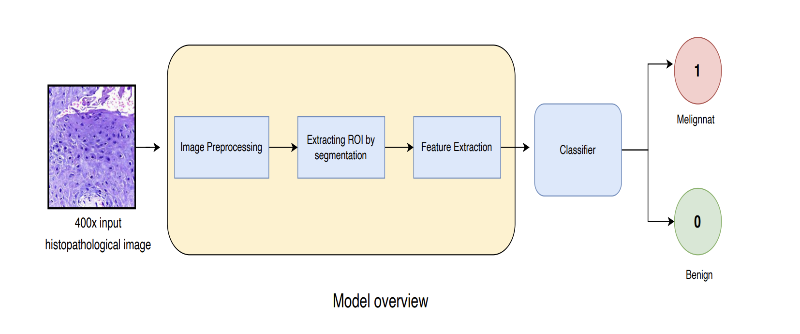
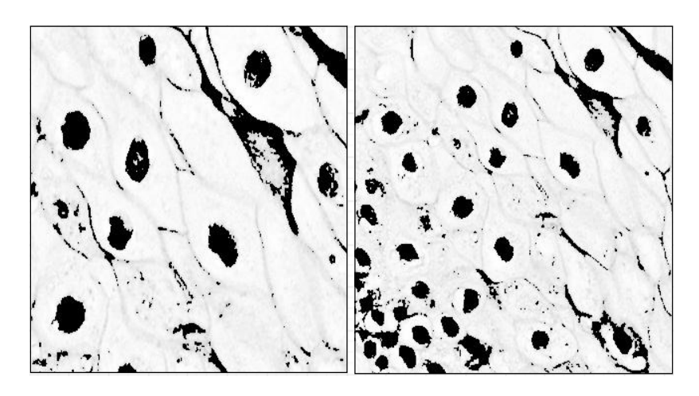
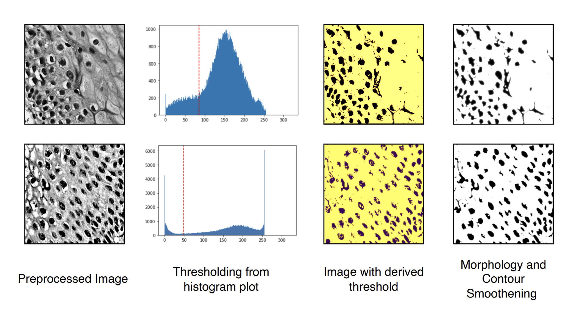

# Oral Cancer Detection with Machine Vision

## Introduction
Oral cancer, a formidable global health challenge, underscores the urgency for accurate and swift detection. Current diagnostic strategies heavily rely on pathologists analyzing tissue biopsy samples—a method both time-consuming and reliant on the pathologist's experience. In response, our study introduces an innovative technique that integrates machine vision, aiming to enhance diagnostic accuracy. Employing an unsupervised approach for cancer detection, we identify the nucleus in cancerous tissue biopsy images as the Region of Interest (ROI). The ROI is extracted using K-means clustering augmented with a thresholding technique, followed by a novel classification method. Our proposed model achieved an accuracy of approximately 97.28%, with a closely following validation accuracy of roughly 96.34%, demonstrating improved speed and precision in identifying cancerous tissues.

## Key Features
- **Unsupervised Approach**: Given the intricate nature of histopathological images, our approach differs from traditional deep learning or supervised methods.
- **Nucleus as ROI**: Identification of the nucleus as the Region of Interest (ROI) due to its key characteristics and form.
- **Segmentation Methodology**: Extraction of the ROI using K-means clustering augmented with a thresholding technique.
- **Novel Classification Method**: Application of a unique classification method for the final stage of cancer detection.

## Methodology
### Dataset
We utilized a dataset comprising 1224 histopathological images, segmented into two sets based on magnification levels - 100× and 400×.

#### Breakdown:
- 100× magnification set: 89 images of regular oral tissue and 439 images displaying a specific form of oral cancer.
- 400× magnification set: 201 images showing regular oral tissue and 495 images demonstrating the same oral cancer type.

### Nuclei Segmentation Process
For extracting the Region of Interest (ROI) from 400× magnification biopsy images, we employed the following steps:

1. **Image Preprocessing**: Staining, transforming to HSV color space, Contrast Limited Adaptive Histogram Equalization (CLAHE), and conversion to grayscale.
2. **Segmentation Methodology**: K-means clustering algorithm with k set to 3 for effective segmentation.

## Conclusion
Our two-stage process, starting with image segmentation followed by CNN-based binary classification, showcases an accuracy of approximately 97.28%. This project offers a promising pathway for enhancing the efficacy and efficiency of oral cancer detection.

